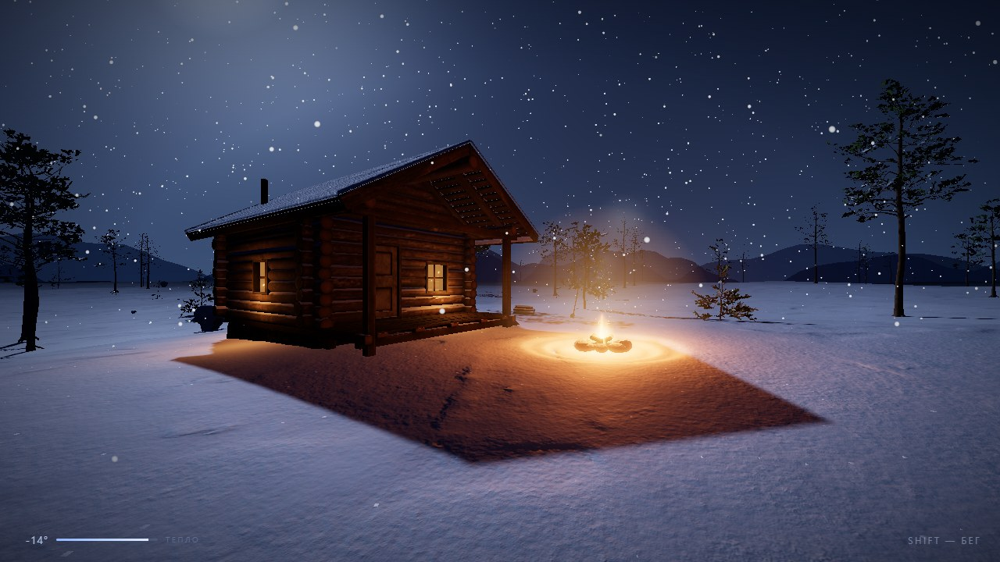
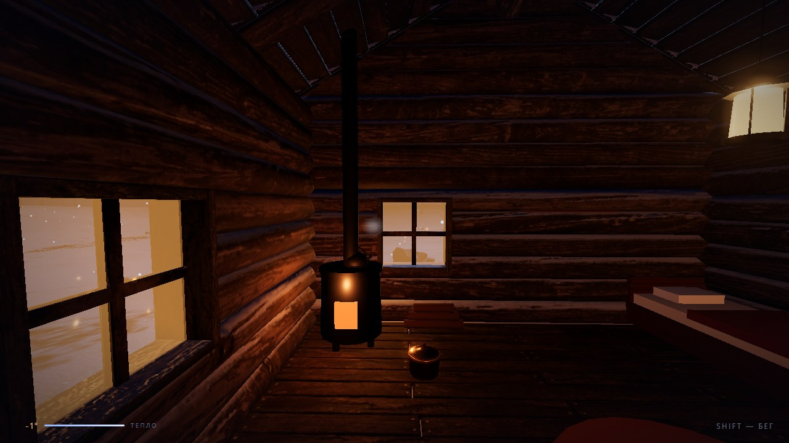
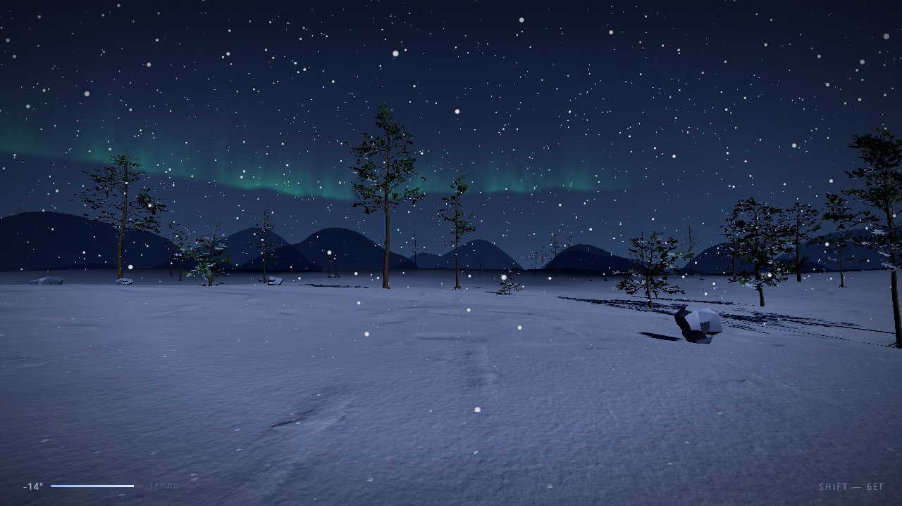
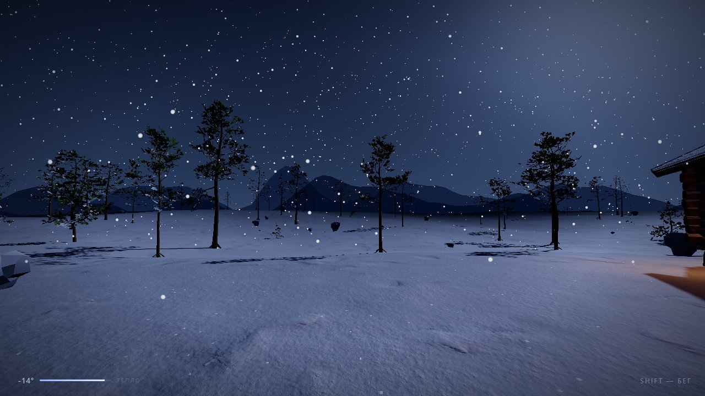

# SNOWFALL

### ❄️ [Играть в браузере → antonov-ai.ru/snowfall](https://antonov-ai.ru/snowfall/)

Ничего устанавливать не нужно — первая загрузка ~20 МБ. На десктопе играют
мышью и клавиатурой, на телефоне и планшете работает тач-управление
(появляется само на сенсорных экранах).

**Android:** [скачать APK](https://antonov-ai.ru/snowfall/snowfall.apk) — та же
игра, целиком офлайн, без интернета после установки. Установка APK не из
магазина требует разрешить «неизвестные источники». Публикация в RuStore —
в работе.


|  |  |
|---|---|
|  |  |

Атмосферная 3D-игра от первого лица: зимняя ночь в духе The Long Dark.
Three.js + Vite, весь звук синтезируется процедурно (WebAudio).
Модели и текстуры — CC-BY/CC0 (Sketchfab, Poly Haven, Quaternius), см. «Лицензии» ниже.

## Запуск

```bash
npm install
npm run dev          # http://localhost:5173
npm run build        # прод-сборка сайта в dist/
npm run apk          # Android debug-APK (Capacitor)
npm run apk:release  # подписанный релиз для RuStore
```

Android-сборка описана в [deploy/ANDROID.md](deploy/ANDROID.md): требования,
ключ подписи, что настроено в нативной части, проверка на эмуляторе.

## Управление

| Клавиша | Действие |
|---|---|
| WASD | движение |
| Shift | бег |
| Пробел | прыжок |
| F | контекстная «рука»: дверь, дрова, лопата |
| ЛКМ / ПКМ | копать / намывать снег (с лопатой) |
| Мышь | обзор (pointer lock) |
| Esc | пауза / меню |

**Телефон и планшет** (включается само на сенсорных экранах, `src/touch.js`):
палец на левой половине экрана ведёт тело — невидимый аналоговый стик от точки
касания, чем дальше увёл, тем быстрее шаг, до бега; палец на правой половине
поворачивает взгляд. Кнопки справа внизу — прыжок, контекстная «рука» (та же,
что F, появляется только когда есть что сделать) и работа инструментом,
когда он в руках. Нарисованных джойстиков нет.

Debug-режим без pointer lock: `http://localhost:5173/?debug` (поворот — стрелки).

## Что внутри

- **Террейн** — процедурный рельеф (ImprovedNoise) + PBR-текстуры снега
  с Poly Haven (CC0: diffuse, normal, roughness), кастомный шейдер:
  мерцающие искры-блёстки, зависящие от угла взгляда.
- **Деформируемый снег** — отпечатки штампуются в render target (карту деформации);
  плотная сетка 32×32 м вокруг игрока реально вдавливается по ней в вершинном
  шейдере (базовый террейн под патчем вырезается), вдали следы дорисовываются
  возмущением нормалей; снег постепенно заметает следы.
- **Костёр** — модель костровища Poly Haven, шейдерное пламя, искры, дым,
  мерцающий свет, проталина; позиционный процедурный звук; у огня можно отогреться.
- **Модели** — ели и камни Quaternius (CC0, инстансинг), снег на кронах шейдером.
- **Снегопад** — 6500 GPU-частиц, зацикленных вокруг камеры, дрейф привязан
  к порывам ветра из аудио.
- **Небо** — шейдерный купол, ~2600 мерцающих звёзд, луна с гало,
  лунный directional light с мягкими тенями (PCFSoft).
- **Звук** — полностью процедурный: вой ветра (4 слоя фильтрованного шума с LFO,
  свист с высоким Q, случайные порывы) и хруст снега (серия шумовых «зёрен» +
  низкочастотный удар), различается для ходьбы и бега.
- **Игрок** — инерция движения, head bob, FOV-раскачка при беге,
  шаги по пройденной дистанции, коллизии со стволами елей.
- **Северное сияние** — шейдерная «занавесь» (fbm-шум, лучи), дышит и гаснет в метель.
- **Дальние хребты** — два кольца зубчатых силуэтов за туманом.
- **Метель** — порывы ветра из аудио управляют плотностью тумана, скоростью
  и сносом снегопада, видимостью хребтов и авроры.
- **Пар дыхания** — спрайтовые выдохи, частота растёт после бега, пар сносит ветром;
  запыхавшись, персонаж слышно дышит.
- **Выживание (TLD)** — шкалы тепла и сил: бег тратит выносливость (истощение —
  бежать нельзя, пока не отдышишься), мороз и метель вытягивают тепло, движение греет;
  изморозь по краям экрана, смерть от холода с перезапуском.
- **Пост-обработка** — ACES tonemapping, UnrealBloom, CSS-виньетка.

## Структура

```
src/
  main.js         сборка сцены, свет, пост-обработка, метель, цикл
  snowmaterial.js общий шейдер снега (текстуры, искры, следы, деформация)
  terrain.js      рельеф + запечённая heightmap
  snowpatch.js    деформируемый патч снега вокруг игрока
  footprints.js   render target следов: отпечатки, проталины, заметание
  snowfall.js     GPU-частицы снегопада (фазы ветра/падения без скачков)
  sky.js          купол неба, звёзды, луна
  aurora.js       северное сияние (шейдерная занавесь)
  ridges.js       дальние горные хребты
  trees.js        сосновый лес (GLTF, LOD-кольца, инстансинг) + камни
  cabin.js        обитаемый домик: дверь, интерьер, пропсы, коллизии
  digger.js       воксельное копание снега (marching cubes, чанки)
  shovel.js       лопата: копать/намывать по прицелу
  firewood.js     дрова: поленница, переноска, подброс в костёр
  campfire.js     костёр: пламя, искры, дым, свет
  breath.js       пар от дыхания (пул спрайтов)
  player.js       контроллер от первого лица, выносливость
  collide.js      коллизии тела/камеры (итеративный решатель)
  look.js         взгляд/прицеливание, подсказки у объектов
  viewmodel.js    рука/предмет от первого лица
  critters.js     живность
  save.js         сохранение прогресса (localStorage)
  audio.js        процедурный ветер, хруст снега, дыхание, костёр
  stats.js        тепло/мороз, костёр греет, HUD, изморозь, смерть
  gltfload.js     общий GLTFLoader (Draco + WebP)
public/textures/  снег Poly Haven (CC0)
public/models/    домик, сосны, камни, пропсы — см. CREDITS.md
public/draco/     Draco-декодер (из пакета three)
```

## Идеи на доработку

- Волки/олени на горизонте, звуки дикой природы
- Смена погоды по таймлайну (затишье → буран), цикл ночи
- Сохранение лучшего времени выживания

## Деплой

Статика, сервера не нужно: `npm run build` → раздать `dist/` любым
веб-сервером. Готовый конфиг nginx (gzip, кэш-заголовки) и шпаргалка —
в [deploy/](deploy/).

**Android.** `npm run apk:release` собирает подписанный APK: те же файлы
в системном WebView, всё офлайн, никаких запросов в сеть после установки.
Пакет `ru.antonovai.snowfall`, minSdk 23 (Android 6), альбомная ориентация,
полный экран. Подробности и работа с ключом подписи — [deploy/ANDROID.md](deploy/ANDROID.md).

## Лицензии

- **Код** — [MIT](LICENSE).
- **Ассеты** — под своими лицензиями (CC-BY-4.0 / CC0), не покрываются MIT:
  полный список с авторами и ссылками — [public/models/CREDITS.md](public/models/CREDITS.md).
  - «Scandinavian Log Cabin» by rivetech — CC-BY-4.0
  - «Pine trees pack» by LOLIPOP — CC-BY-4.0
  - Камни Quaternius (CC0), пропсы и текстуры снега Poly Haven (CC0)
- Модели пережаты для веба (WebP-текстуры + Draco-геометрия, gltf-transform);
  оригиналы доступны по ссылкам в CREDITS.md.
