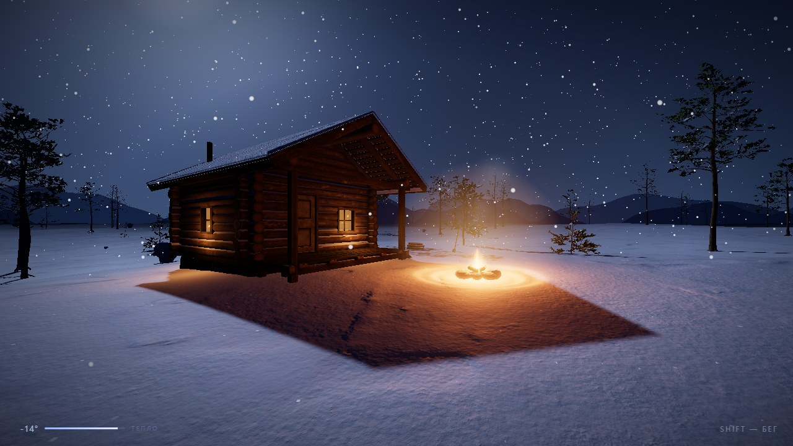
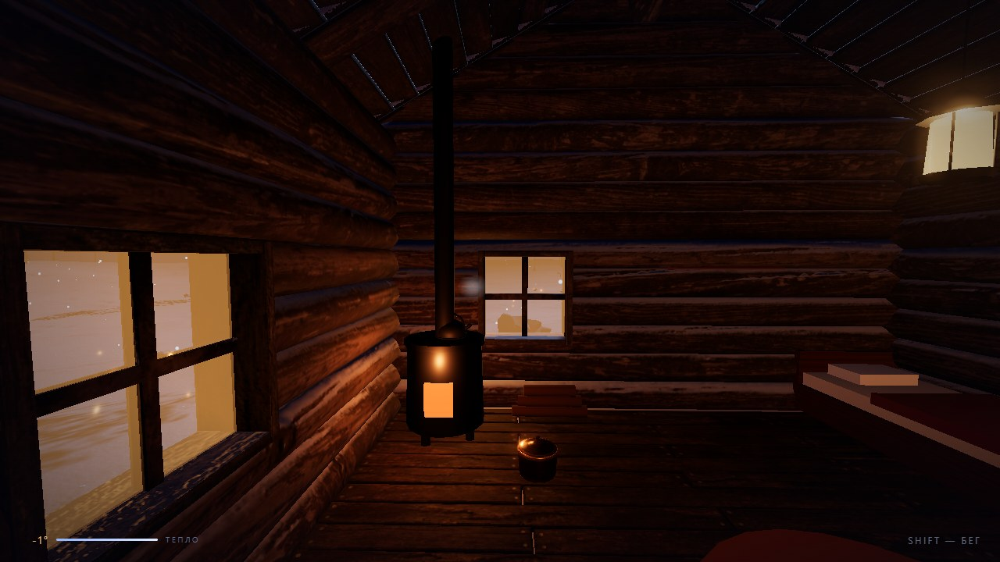
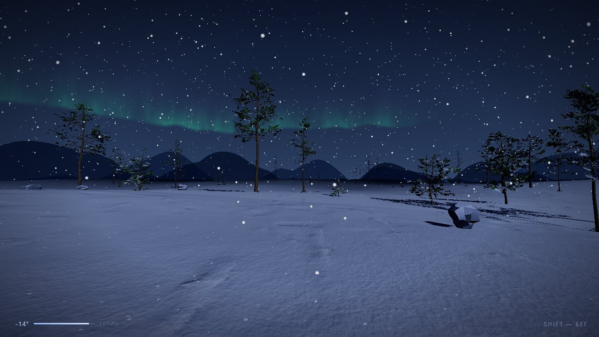
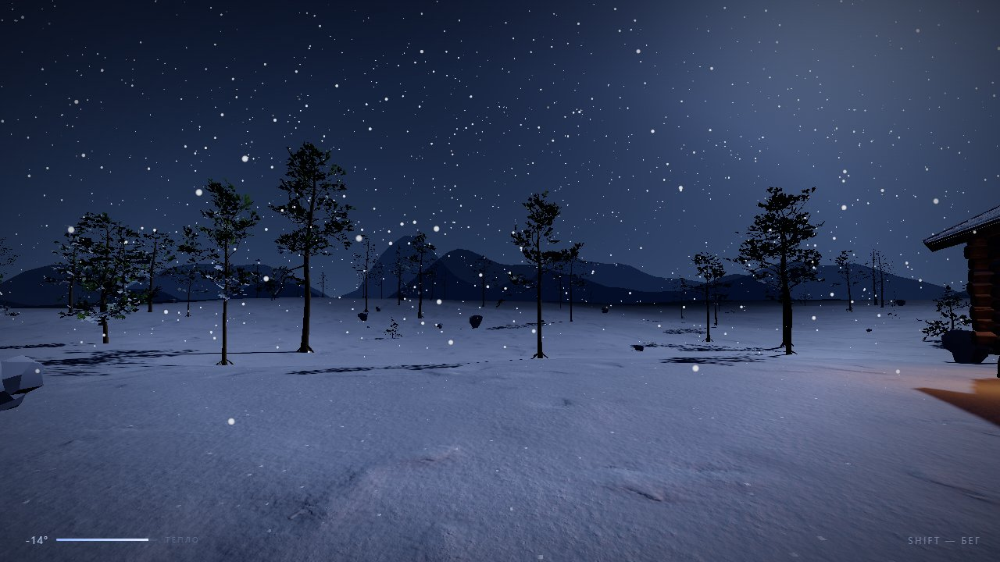

# SNOWFALL

[](https://github.com/HippocampusEvolve/Snowfall/actions/workflows/ci.yml)
[](https://github.com/HippocampusEvolve/Snowfall/releases/latest)
[](LICENSE)

### ❄️ [Играть в браузере → antonov-ai.ru/snowfall](https://antonov-ai.ru/snowfall/)

Ничего устанавливать не нужно — первая загрузка ~20 МБ. На десктопе играют
мышью и клавиатурой, на телефоне и планшете работает тач-управление
(появляется само на сенсорных экранах).

**Android:** [скачать APK](https://github.com/HippocampusEvolve/Snowfall/releases/latest)
(зеркало: [antonov-ai.ru/snowfall/snowfall.apk](https://antonov-ai.ru/snowfall/snowfall.apk)) —
та же игра, целиком офлайн, без интернета после установки. Установка APK не из
магазина требует разрешить «неизвестные источники». Публикация в RuStore — в работе.


|  |  |
|---|---|
|  |  |

Атмосферная 3D-игра от первого лица: зимняя ночь в духе The Long Dark.
Three.js + Vite, весь звук синтезируется процедурно (WebAudio).
Сторонние модели и текстуры - CC0 (Poly Haven), см. «Лицензии» ниже.

## Запуск

```bash
npm install
npm run dev          # http://localhost:5173
npm run build        # прод-сборка сайта в dist/
npm run apk          # Android debug-APK (Capacitor)
npm run apk:release  # подписанный релиз для RuStore
```

Android-сборка описана в [deploy/ANDROID.md](deploy/ANDROID.md): требования,
ключ подписи, что настроено в нативной части, проверка на эмуляторе.

## Локальная реализация — 05.09.2026

Ниже описана текущая локальная рабочая версия. Этот раздел не объявляет
новый выпуск или обновление опубликованной игры.

- **Хозяйство видно в мире.** Камни, грунт, снег, руда, блоки, строительные
  брёвна и запасные факелы лежат на отдельных настилах у верстака. Добытый
  предмет сначала остаётся на земле; его берут и переносят по одному.
  В руках один предмет или инструмент. Скрытого мешочка с ресурсами нет:
  предмет в руке исключается из видимой кучи, положенный на землю остаётся
  в своей точке после загрузки.
- **Строительство начинается с бревна.** Топором по лежащему стволу:
  ЛКМ отделяет поленья, ПКМ — длинное строительное бревно за три единицы
  древесины; при меньшем остатке получается полено. Принести бревно,
  навести взгляд на место и нажать F — положить первое. Следующие детали
  выравниваются по торцу или ложатся следующим венцом. На верхнем краю стены
  можно класть доски крыши, если противоположная стена держит второй конец.
  Проём оставляют свободным; перемычке нужны опоры с двух сторон. Пустой
  рукой по F можно вынуть ненагруженную деталь. Каменные блоки также
  укладываются отдельно, со швами. Постройка сохраняется, имеет коллизии
  и укрывает от погоды; детали нельзя класть внутри игрока или препятствий.
- **Верстак выбирают взглядом.** На столе отдельные образцы дерева, камня
  и железистого камня. Навести на нужный образец и нажать F: одно полено
  даёт два факела, четыре камня — блок, два куска руды — блок. Результат
  появляется в соответствующем запасе у верстака, без меню рецептов.
- **Факел нужно зажечь.** Новый факел не горит. Взять его со стойки,
  поднести к горящему костру или камину и нажать F. Полного факела хватает
  на десять минут в укрытии; метель ускоряет расход и может задуть пламя.
  F вне другого контекстного действия или T ставит факел в мир. Его место,
  состояние и остаток топлива сохраняются; время отсутствия учитывается.
- **Дом нужно топить.** Полный запас камина рассчитан на восемнадцать минут,
  одно поднесённое полено добавляет шесть минут до заполнения. Без топлива
  камин перестаёт греть. Дом по-прежнему защищает от погоды, но сам по себе
  не заменяет огонь. Топливо камина также расходуется за время отсутствия.
- **Лаборатория работает в игре.** Топор, кирка, молот и факел используют
  процедурные модели из нашей лаборатории, с хватом руки и игровыми позами.
  Её кролик появляется вдали в спокойную погоду и уходит при приближении;
  геометрия рассчитывается в отдельном worker. Это локальная проба редкой
  встречи, а лоси и волки остаются направлением из [VISION.md](VISION.md).

## Управление

| Клавиша | Действие |
|---|---|
| WASD | движение |
| Shift | бег |
| Пробел | прыжок |
| F | контекстная «рука»: дверь, взять/положить предмет или инструмент, сложить запас, изготовить у верстака, уложить/вынуть деталь, подбросить полено, зажечь/поставить факел |
| ЛКМ / ПКМ | копать / намывать снег (с лопатой) |
| ЛКМ с топором | валить дерево; разделывать лежащий ствол на поленья |
| ПКМ с топором | отделять строительные брёвна от лежащего ствола |
| ЛКМ с киркой или молотом | долбить камень |
| T | поставить удерживаемый факел; взять существующий факел, на который смотришь, с земли или стойки |
| Мышь | обзор (pointer lock) |
| Esc | пауза (она же выход на витрину) |

Списка клавиш в самой игре нет, как нет счётчиков, шкал и панелей настройки:
в кадре остаются только контекстные подсказки у объектов. Экран входа, полоса
загрузки и выход одинаковы во всех мирах find-the-end.fun (`src/shell.js`).

**Телефон и планшет** (включается само на сенсорных экранах, `src/touch.js`):
палец на левой половине экрана ведёт тело — невидимый аналоговый стик от точки
касания, чем дальше увёл, тем быстрее шаг, до бега; палец на правой половине
поворачивает взгляд. Кнопки справа внизу — прыжок, контекстная «рука» (та же,
что F, появляется только когда есть что сделать) и работа инструментом,
когда он в руках. Нарисованных джойстиков нет.

У лопаты две кнопки: копать и намывать; у топора — поленья и строительные
брёвна. Удержание кнопки повторяет удары. Кнопка факела повторяет T:
поставить удерживаемый или взять тот, на который наведен взгляд.
Поджечь факел у огня, изготовить предмет у верстака и собирать постройку
можно контекстной кнопкой «рука».

Debug-режим без pointer lock: `http://localhost:5173/?debug` (поворот — стрелки).

## Что внутри

- **Террейн** — процедурный рельеф (ImprovedNoise) + процедурные PBR-карты
  снега из `world-core/materials`, кастомный шейдер:
  мерцающие искры-блёстки, зависящие от угла взгляда.
- **Деформируемый снег** — отпечатки штампуются в render target (карту деформации);
  плотная сетка 32×32 м вокруг игрока реально вдавливается по ней в вершинном
  шейдере (базовый террейн под патчем вырезается), вдали следы дорисовываются
  возмущением нормалей; снег постепенно заметает следы.
- **Костёр** — процедурное костровище, шейдерное пламя, искры, дым,
  мерцающий свет, проталина; позиционный процедурный звук; у огня можно отогреться.
- **Модели** - сосны и валуны считаются кодом от семени (src/pine.js, src/rock.js), инстансинг, снег на кронах шейдером.
- **Снегопад** — 6500 GPU-частиц, зацикленных вокруг камеры, дрейф привязан
  к порывам ветра из аудио.
- **Небо** — шейдерный купол, ~2600 мерцающих звёзд, луна с гало,
  лунный directional light с мягкими тенями (PCFSoft).
- **Звук** — полностью процедурный: вой ветра (4 слоя фильтрованного шума с LFO,
  свист с высоким Q, случайные порывы) и хруст снега (серия шумовых «зёрен» +
  низкочастотный удар), различается для ходьбы и бега.
- **Игрок** — инерция движения, head bob, FOV-раскачка при беге,
  шаги по пройденной дистанции, коллизии со стволами елей.
- **Северное сияние** — шейдерная «занавесь» (fbm-шум, лучи), дышит и гаснет в метель.
- **Дальние хребты** — два кольца зубчатых силуэтов за туманом.
- **Метель** — порывы ветра из аудио управляют плотностью тумана, скоростью
  и сносом снегопада, видимостью хребтов и авроры.
- **Пар дыхания** — спрайтовые выдохи, частота растёт после бега, пар сносит ветром;
  запыхавшись, персонаж слышно дышит.
- **Тепло и усталость** — бег тратит силы, мороз и метель охлаждают,
  движение и огонь греют. Состояние читается через дыхание и изморозь,
  без шкал тепла и ресурсов; гибель от холода не стирает сделанное в мире.
- **Пост-обработка** — ACES tonemapping, UnrealBloom, CSS-виньетка.

## Структура

```
src/
  main.js         сборка сцены, свет, пост-обработка, метель, цикл
  snowmaterial.js общий шейдер снега (текстуры, искры, следы, деформация)
  terrain.js      рельеф + запечённая heightmap
  snowpatch.js    деформируемый патч снега вокруг игрока
  footprints.js   render target следов: отпечатки, проталины, заметание
  snowfall.js     GPU-частицы снегопада (фазы ветра/падения без скачков)
  sky.js          купол неба, звёзды, луна
  aurora.js       северное сияние (шейдерная занавесь)
  ridges.js       дальние горные хребты
  trees.js        сосновый лес (GLTF, LOD-кольца, инстансинг) + камни
  cabin.js        обитаемый домик: дверь, интерьер, пропсы, коллизии
  digger.js       воксельное копание снега (marching cubes, чанки)
  shovel.js       лопата: копать/намывать по прицелу
  firewood.js     дрова: поленница, переноска, подброс в костёр
  resources.js    настилы запасов, переноска по одному, предметы на земле
  homestead.js    отдельные детали стен и крыши, наведение, разборка, укрытие
  homestead-rules.js опоры, стыковка и допустимость размещения
  torch.js        переносимый/поставленный факел, зажигание и конечное топливо
  hearth-state.js запас камина и расход топлива, включая время отсутствия
  campfire.js     костёр: пламя, искры, дым, свет
  breath.js       пар от дыхания (пул спрайтов)
  player.js       контроллер от первого лица, выносливость
  collide.js      коллизии тела/камеры (итеративный решатель)
  look.js         взгляд/прицеливание, подсказки у объектов
  viewmodel.js    рука/предмет от первого лица
  critters.js     живность
  wildlife.js     редкие встречи с лабораторным кроликом
  wildlife.worker.js расчёт геометрии кролика вне главного потока
  save.js         журнал и состояние мира в IndexedDB; fallback localStorage
  audio.js        процедурный ветер, хруст снега, дыхание, костёр
  stats.js        тепло/мороз, костёр греет, изморозь, смерть
  shell.js        оболочка мира: экран входа, пауза, выход на витрину
  props/          предметы кодом: кострище, камин, лопата, котелок, книги
    lab/          перенесённые генераторы инструментов и кролика, происхождение
    parts.js        описание примитивами без three: счёт и габарит
    build.js        сборка в three: один меш на роль
public/tex/       снег Poly Haven (CC0) — единственные картинки в сборке
```

## Идеи на доработку

- Волки/олени на горизонте, звуки дикой природы
- Смена погоды по таймлайну (затишье → буран), цикл ночи
- Сохранение лучшего времени выживания

## Деплой

Статика, сервера не нужно: `npm run build` → раздать `dist/` любым
веб-сервером. Готовый конфиг nginx (gzip, кэш-заголовки) и шпаргалка —
в [deploy/](deploy/).

**Android.** `npm run apk:release` собирает подписанный APK: те же файлы
в системном WebView, всё офлайн, никаких запросов в сеть после установки.
Пакет `ru.antonovai.snowfall`, minSdk 23 (Android 6), альбомная ориентация,
полный экран. Подробности и работа с ключом подписи — [deploy/ANDROID.md](deploy/ANDROID.md).

**Витрины магазинов.** Иконка, скриншоты 16:9, обложка 800×470 и готовые
тексты описаний (краткое/среднее/полное) — в [store/](store/). Сам APK — в
[Releases](https://github.com/HippocampusEvolve/Snowfall/releases).

## Лицензии

- **Код** — [MIT](LICENSE).
- **Ассеты** — под своими лицензиями (CC0), не покрываются MIT
  (сводка — [NOTICE.md](NOTICE.md)):
  полный список с авторами и ссылками — [public/models/CREDITS.md](public/models/CREDITS.md).
  - Текстуры снега Poly Haven (CC0) — единственные картинки в сборке
- Геометрия вся своя и вся кодом: моделей файлами в проекте нет.
