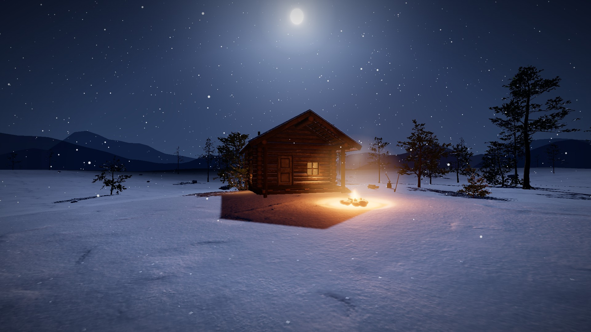
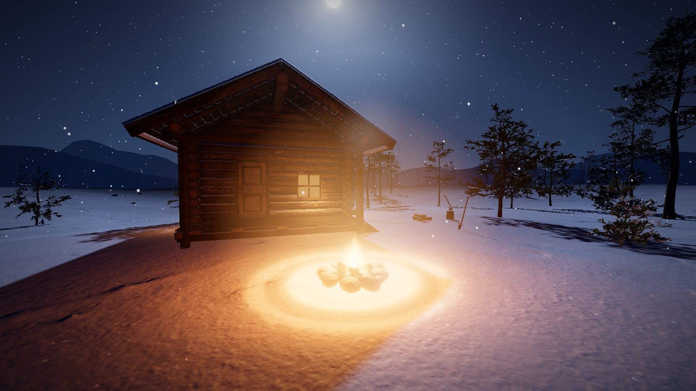
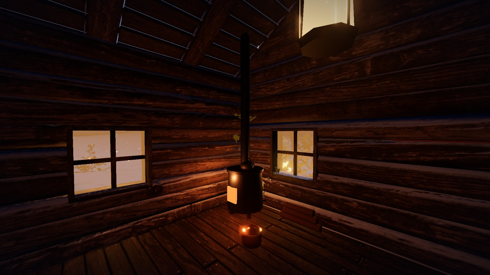
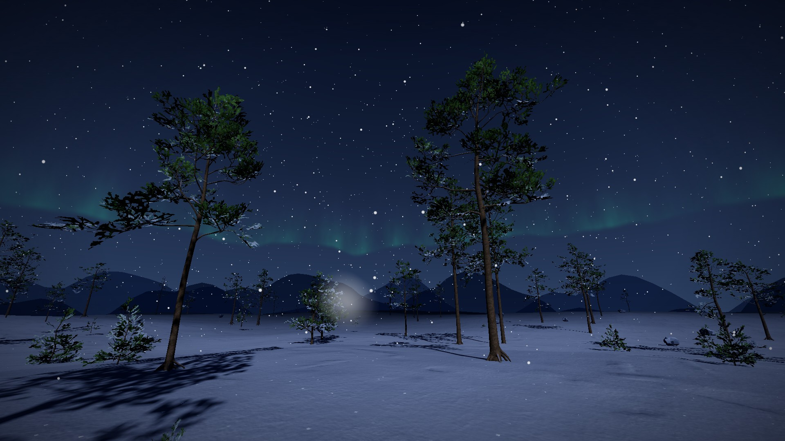
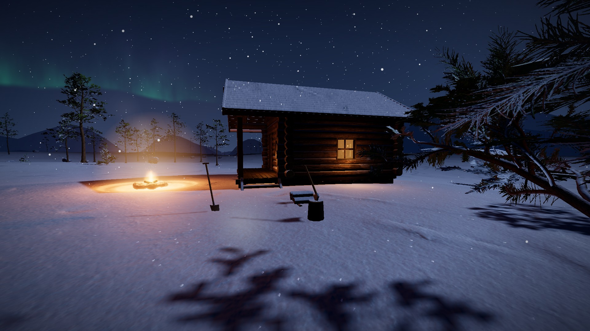
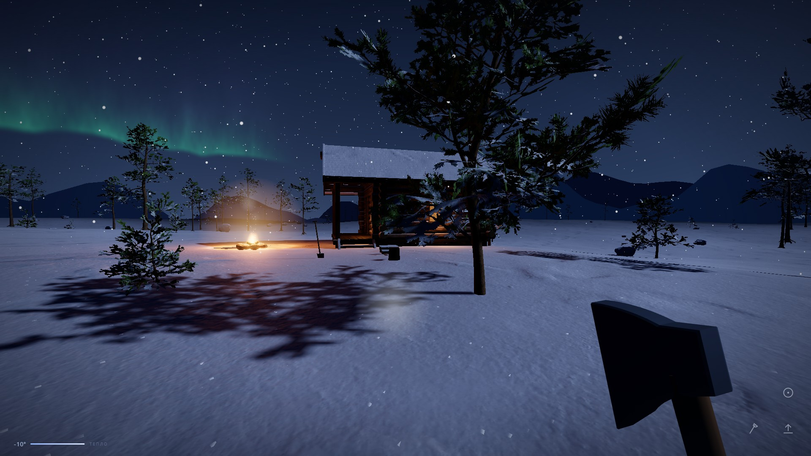

# Материалы для магазинов приложений

Всё, что нужно для карточки Snowfall в RuStore (и в других витринах —
Яндекс, F-Droid-подобные каталоги): иконка, скриншоты, обложка, готовые
тексты описаний и сам APK.

## Что здесь лежит

| Файл | Что это | Размер |
|---|---|---|
| [icon-512.png](icon-512.png) | иконка приложения | 512×512 |
| [cover-800x470.jpg](cover-800x470.jpg) | обложка/баннер карточки | 800×470 |
| [cover-src.html](cover-src.html) | исходник обложки — пересобрать другой размер | — |
| [screenshots/](screenshots/) | шесть игровых кадров 16:9 | 1920×1080 |
| snowfall-0.17.0.apk | подписанный релиз для загрузки в магазин | 16.6 МБ |

Скриншоты:

| | |
|---|---|
|  |  |
|  |  |
|  |  |

Последний кадр — с включёнными тач-кнопками: видно, как играют с телефона.

## Тексты описаний

### Краткое (до 80 символов)

```
Зимняя ночь в тайге: топи костёр, руби дрова и доживи до утра
```

### Среднее (анонс, ~250 символов)

```
Атмосферная игра от первого лица о долгой зимней ночи. Один домик, костёр,
поленница и метель до горизонта. Топите печь, рубите дрова, копайте укрытие
в снегу — и не дайте себе замёрзнуть. Без интерфейса, без подсказок: обо всём
говорят снег, звук и собственное дыхание.
```

### Полное

```
Долгая тёмная ночь на севере. Есть домик с тёплыми окнами, костёр перед ним,
поленница у стены и метель, которая выдувает тепло быстрее, чем кажется.
Задача одна — дожить до утра.

SNOWFALL — созерцательная игра о выживании от первого лица. Здесь не стреляют
и никуда не спешат: вы топите костёр, носите поленья, рубите топором сосны,
копаете лопатой снег и слушаете, как меняется ветер.

ЧТО МОЖНО ДЕЛАТЬ
• Поддерживать огонь: костёр по-настоящему ест дрова и гаснет до углей
• Валить сосны топором и разделывать стволы на поленья
• Складывать поленницу — запас, который видно глазами, а не цифрой
• Копать снег лопатой: настоящий объём, а не дырка в текстуре, — можно
  вырыть нору и переждать в ней метель
• Заходить в домик, топить печь, греться и слушать, как за стеной воет ветер
• Просто идти по целине и смотреть на северное сияние

БЕЗ ИНТЕРФЕЙСА
В игре почти нет экранных шкал. Устал — слышно по дыханию и видно по тому,
как ведёт камеру. Замерзаешь — по краям экрана растёт изморозь, а руки
начинают дрожать. Дров осталось мало — видно по поленнице. Мир и есть
интерфейс.

ЖИВОЙ МИР
Снег помнит: следы остаются на насте и медленно заметаются, у костра
протаивает круг, вырытая нора никуда не денется. Всё это сохраняется —
можно закрыть игру и вернуться в ту же ночь.

ЗВУК
Весь звук синтезируется на ходу, ни одного записанного файла: вой ветра и его
порывы, скрип снега под ногами на морозе, треск огня, собственное дыхание.
Наушники очень желательны.

УПРАВЛЕНИЕ С ТЕЛЕФОНА
Нарисованных джойстиков нет. Палец на левой половине экрана ведёт вас: чем
дальше увели — тем быстрее шаг, до бега. Палец на правой поворачивает взгляд.
Кнопки появляются только тогда, когда есть что сделать: прыжок, взять или
положить, ударить инструментом.

ОСОБЕННОСТИ
• Полностью офлайн: после установки интернет не нужен
• Никакой рекламы, покупок и подписок
• Не собирает никаких данных — сохранение лежит только на вашем устройстве
• Никаких разрешений к камере, микрофону, контактам или геопозиции
• Есть и браузерная версия: antonov-ai.ru/snowfall
```

## Требования витрин (шпаргалка)

**RuStore** — иконка 512×512 PNG, минимум 3 скриншота (16:9 для альбомной
игры), краткое описание до 80 символов, полное до 4000. Загружается APK,
подписанный своим ключом (см. [../deploy/ANDROID.md](../deploy/ANDROID.md)).
Покупок и рекламы нет → RuStore Pay и 54-ФЗ не нужны; персональные данные
не собираются → политика конфиденциальности не требуется.

**Возрастной рейтинг** — 6+: насилия, крови и страшных сцен нет; есть
условная смерть от холода (экран гаснет и предлагает начать заново).

**Категория** — «Игры → Приключения» (либо «Симуляторы», если в витрине нет
подходящей подкатегории).

## Как пересобрать материалы

Иконка (и растровые версии для Android < 8):

```bash
node tools/make-icons.mjs
```

Скриншоты и обложка снимаются с живой игры: `npm run dev`, затем страница
`?debug` (даёт доступ к `window.__snow` — можно поставить камеру в нужную
точку) и `?touch` (показывает мобильные кнопки на десктопе). Обложка —
`store/cover-src.html`, открытая в окне ровно 800×470.

> APK лежит прямо в репозитории по просьбе владельца проекта — так все
> материалы для магазина в одном месте. Учтите: каждая новая версия APK
> добавляет к истории git ~17 МБ навсегда. Если репозиторий начнёт тяжелеть,
> APK стоит перенести в GitHub Releases, а здесь оставить ссылку.
